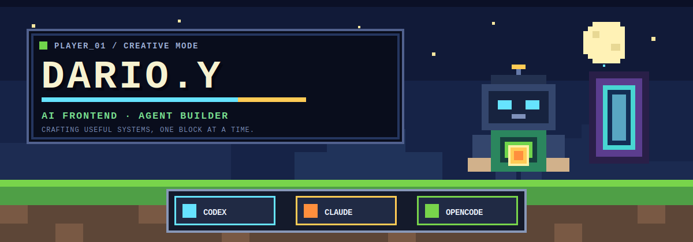

  

  <a href="https://github.com/Wenjunyun123"><strong>⌂ HOME</strong></a>
  &nbsp;&nbsp;│&nbsp;&nbsp;
  <a href="https://github.com/Wenjunyun123?tab=repositories"><strong>▦ WORLDS</strong></a>
  &nbsp;&nbsp;│&nbsp;&nbsp;
  <a href="https://space.bilibili.com/424758400"><strong>▶ BILIBILI</strong></a>

---

## `PLAYER_01 // PROFILE`

<table>
  <tr>
    <td width="58%" valign="top">
      <h3>Hey, I'm Dario.Y.</h3>
      

        AI Frontend Engineer & Agent Builder。 
        我把模型、界面和自动化流程拼成真正能用的产品系统。
      

      
<strong>Current quest:</strong> 让 AI 能力更可操作，让复杂工作流更可观察。

    </td>
    <td width="42%" valign="top">
      <pre><code>CLASS   AI Frontend Engineer
MODE    Creative / Shipping
SPAWN   Shanghai, CN
BUFF    Agent + UI + Automation
MOTTO   Systems, not demos.</code></pre>
    </td>
  </tr>
</table>

## `QUEST LOG // SELECTED BUILDS`

| Slot | Build | Quest objective | Materials |
|:--:|:--|:--|:--|
| `01` | **[Personal Website](https://github.com/Wenjunyun123/personal-website-development)** | 构建面向招聘与技术品牌的双语个人站点 | TypeScript · Next.js · MDX |
| `02` | **[Codex Skill Knowledge Base](https://github.com/Wenjunyun123/codex-skill-github-repo)** | 把仓库研究沉淀成可复用的 Agent Skills | Python · Shell · TypeScript |
| `03` | **[Deep Learning Coach](https://github.com/Wenjunyun123/deep-learning-coach)** | 用苏格拉底式提问设计主动学习体验 | Agent Skill · Learning UX |
| `04` | **[Personal Knowledge Base](https://github.com/Wenjunyun123/Personal-Knowledge-Base)** | 建造可检索、可连接、持续生长的知识世界 | Knowledge Ops · Markdown |

## `INVENTORY // STACK & TOOLS`

### `HOTBAR — PRODUCT INTERFACE`

### `CRAFTING — AGENT ENGINEERING`

  <kbd>OpenAI API</kbd>
  <kbd>LangChain</kbd>
  <kbd>MCP</kbd>
  <kbd>Agent Workflows</kbd>
  <kbd>n8n</kbd>

### `TOOL BELT — AI CODING`

  <kbd>OpenAI Codex</kbd>
  <kbd>Claude Code</kbd>
  <kbd>OpenCode</kbd>
  <kbd>GitHub CLI</kbd>

### `WORKBENCH — DELIVERY & DESIGN`

  <kbd>Tencent EdgeOne</kbd>
  <kbd>Feishu / Lark</kbd>
  <kbd>Canva</kbd>
  <kbd>Microsoft 365</kbd>

## `WORLD STATS // GITHUB MAP`

  

  
  

## `PORTAL // BILIBILI`

<table>
  <tr>
    <td width="72%">
      <strong>CHANNEL 424758400 IS ONLINE</strong> 
      AI 工具、Agent 工作流、前端实践，以及 Dario.Y 正在建造的新世界。
    </td>
    <td width="28%" align="right">
      <a href="https://space.bilibili.com/424758400"><strong>ENTER PORTAL ▶</strong></a>
    </td>
  </tr>
</table>

---

  <code>BUILD ▪ EXPLORE ▪ SHIP ▪ REPEAT</code> 
  DARIO.Y / PLAYER_01 / 2026

