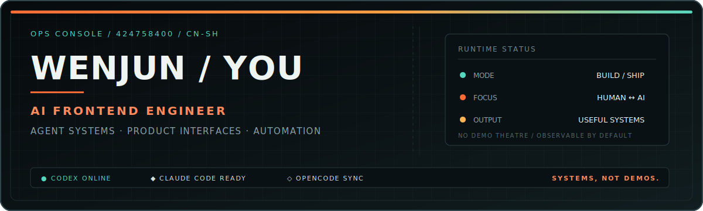

  

  <a href="https://github.com/Wenjunyun123"><strong>GITHUB / CODE</strong></a>
  &nbsp;&nbsp;·&nbsp;&nbsp;
  <a href="https://space.bilibili.com/424758400"><strong>BILIBILI / SIGNAL</strong></a>
  &nbsp;&nbsp;·&nbsp;&nbsp;
  <a href="https://github.com/Wenjunyun123?tab=repositories"><strong>PROJECTS / INDEX</strong></a>

---

## `00 / OPERATOR`

<table>
  <tr>
    <td width="62%" valign="top">
      <h3>把 AI 能力装进真实工作流。</h3>
      

        我是 <strong>Dario.Y</strong>，一名 AI Frontend Engineer。我的工作位于产品界面、
        Agent 系统与自动化交付的交叉点：让模型能力可操作、让复杂流程可观察、让实验真正进入生产。
      

      
<em>I design the interface between people, AI, and real work.</em>

    </td>
    <td width="38%" valign="top">
      <pre><code>ROLE    AI Frontend Engineer
MODE    Build → Observe → Ship
FOCUS   Agent / UI / Automation
BASE    Shanghai, CN
STATUS  Open to useful systems</code></pre>
    </td>
  </tr>
</table>

> **OPERATING PRINCIPLE** — Ship useful systems, not just impressive demos.

## `01 / SYSTEM INDEX`

| ID | System | What it explores | Public signal |
|:--:|:--|:--|:--|
| `A-01` | **[Personal Website](https://github.com/Wenjunyun123/personal-website-development)** | AI 工程师个人品牌、双语内容与前端交付 | TypeScript · Next.js · MDX |
| `A-02` | **[Codex Skill Knowledge Base](https://github.com/Wenjunyun123/codex-skill-github-repo)** | 仓库研究、Agent Skills 与可复用自动化流程 | Python · Shell · TypeScript |
| `A-03` | **[Deep Learning Coach](https://github.com/Wenjunyun123/deep-learning-coach)** | 用苏格拉底式提问构建主动学习体验 | Agent Skill · Learning UX |
| `A-04` | **[Personal Knowledge Base](https://github.com/Wenjunyun123/Personal-Knowledge-Base)** | 把零散探索沉淀成可检索、可连接的知识系统 | Knowledge Ops · Markdown |

## `02 / TOOLCHAIN MAP`

### `L0 — PRODUCT INTERFACE`

### `L1 — AGENT RUNTIME`

  <kbd>OpenAI API</kbd>
  <kbd>LangChain</kbd>
  <kbd>MCP</kbd>
  <kbd>Agent Workflows</kbd>
  <kbd>n8n</kbd>

### `L2 — AI CODING ENVIRONMENT`

  <kbd>OpenAI Codex</kbd>
  <kbd>Claude Code</kbd>
  <kbd>OpenCode</kbd>
  <kbd>GitHub CLI</kbd>

### `L3 — DELIVERY & DESIGN`

  <kbd>Tencent EdgeOne</kbd>
  <kbd>Feishu / Lark</kbd>
  <kbd>Canva</kbd>
  <kbd>Microsoft 365</kbd>

## `03 / SYSTEM TELEMETRY`

  

  
  

## `04 / OPEN CHANNEL`

<table>
  <tr>
    <td width="72%">
      <strong>BILIBILI TRANSMISSION / 424758400</strong> 
      AI 工具、Agent 工作流、前端实践与正在发生的技术探索。
    </td>
    <td width="28%" align="right">
      <a href="https://space.bilibili.com/424758400"><strong>OPEN CHANNEL ↗</strong></a>
    </td>
  </tr>
</table>

---

  <code>BUILD / OBSERVE / SHIP</code> 
  DARIO.Y · AI OPERATIONS · 2026

